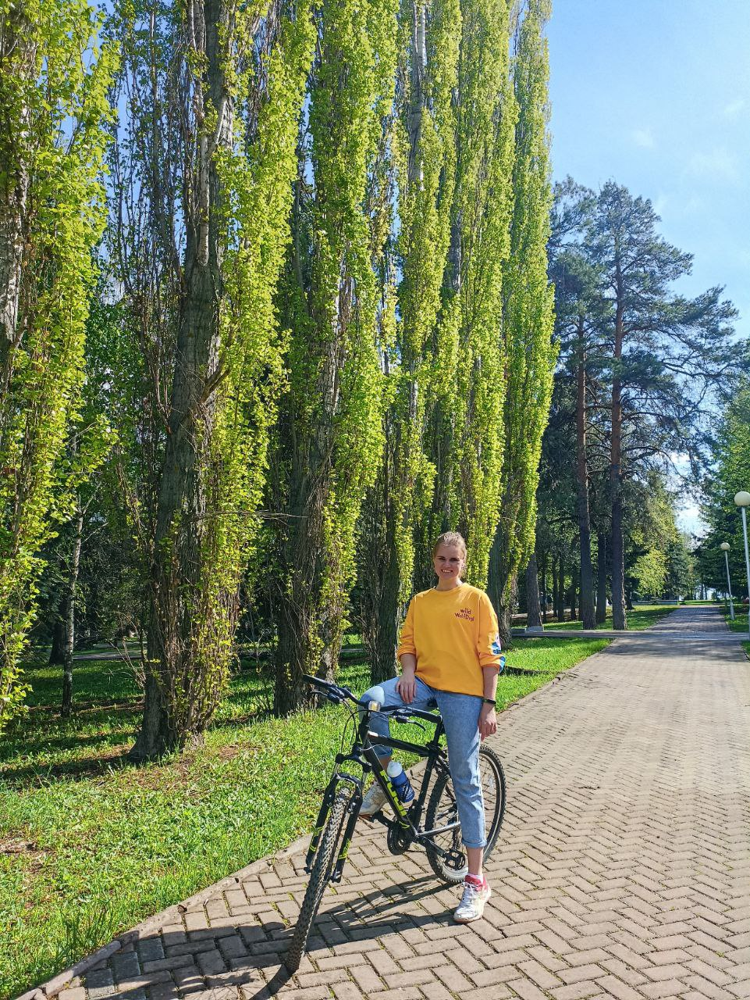

# Обо мне
 
 Всем привет! Меня зовут Приходько Ольга. Мне 29 лет, я люблю узнавать что то новое и поэтому учусь в Нетологии!

# Я и моя внерабочая/внеучебная жизнь:

## 1. Безумно люблю замечать прекрасное в простом и обыденном, и все это запечатлеть мне помогает фотокамера.
   
   .jpeg)

## 2. Люблю путешествия, особенно если маршрут выбран и распланирован самостоятельно.
   
   .jpeg)

## 3. Обожаю крутить педали, все вечерние прогулки на велосипеде.
   
   

## 4. Из командых видов спорта - волейбол, я в нем уже более 15 лет, и  нет желания расставаться.
   
   

## 5. И не так давно, в моей жизни появилось новое увлечение -  спортивное ориентирование. Бег в лесу с картой и компасом доставляет массу удовольствия.
   
   .jpeg)
